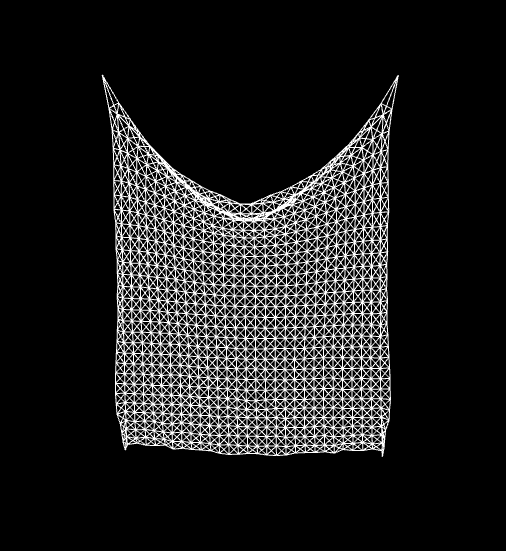

## THREE.js cloth animation

This project is a THREE.js attempt to simulate the physics involved in a cloth material.

  

To do so, the particles are modelized as follows :
* Each particle is a just a point of mass m
* Each of these particles are connected by springs
* Thus far, only the spring force F = k(x - x_0) is considered (not the damping one)

Initially, the cloth is hang at its rigid position, then dropped to physics, with a modulable wind
modifiable with ```vent``` (strength) and ```directionVent``` (direction).

All other parameters are indicated at the top of helperFns.js if some wants to modify them,
it seems the entropy never stops to go up and that the result is a bit chaotic if you wait long
enough, maybe I'll try to add the damping force one day to correct it.

I also have a flag configuration for the cloth, which you can set up quickly just replacing the import 
of helperFns.js with helperFnsFlag.js in main.html (carreful though, it diverges quickly).
<p align="center">
  
</p>

## How to make it work

To make it work, download the repo, then use the following process: https://threejs.org/docs/index.html#manual/en/introduction/How-to-run-things-locally

To sum it up, just run a localhost on your machine (I personally use python -m http.server), then
go to your localhost on your browser and just admire the result.

If you have any suggestion, do not hesitate and leave a comment or a pull request, I'd be happy
to add it to the project.
